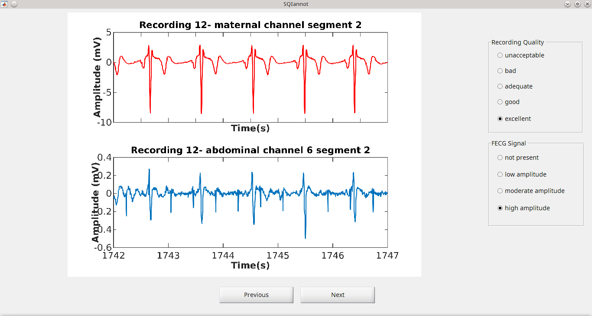

# Matlab GUI for signal quality annotation 

Small interface in Matlab used in my thesis. The objective is to annotate data acording to their SNR and presence of fetal signal. The GUI can be deployed by simpling compiling the project annotator.prj.

Important features:
- Data is contained in compressed .zip file. Inside such file segments to be annotated should be contained in graphical format (.jpg). The compressed file is extracted to a "hidden" file in either Windows or Linux.
- Output is a .dat file, which is nothing more than a text file. Annotation procedure can be interupted at any time and continued, as long as the path to this file is given.
- Shortcuts for annotation are available for noise levels(keys: 1,2,3,4,5) and fetal presence (a,s,d,f).

Tests performed using
- Matlab 2013a - 2016a
- Windows 7 / Ubuntu

## License

Released under the GNU General Public License v3.0

This program is free software: you can redistribute it and/or modify it under the terms of the GNU General Public License as published by the Free Software Foundation, either version 3 of the License, or (at your option) any later version.

This program is distributed in the hope that it will be useful, but WITHOUT ANY WARRANTY; without even the implied warranty of MERCHANTABILITY or FITNESS FOR A PARTICULAR PURPOSE. See the GNU General Public License for more details.

You should have received a copy of the GNU General Public License along with this program. If not, see http://www.gnu.org/licenses/.

